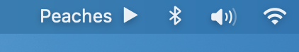
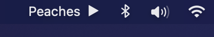
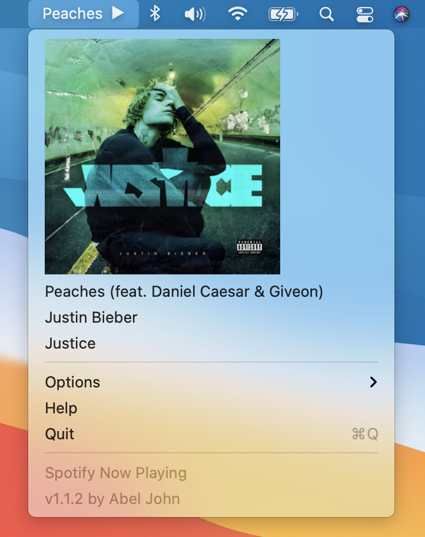
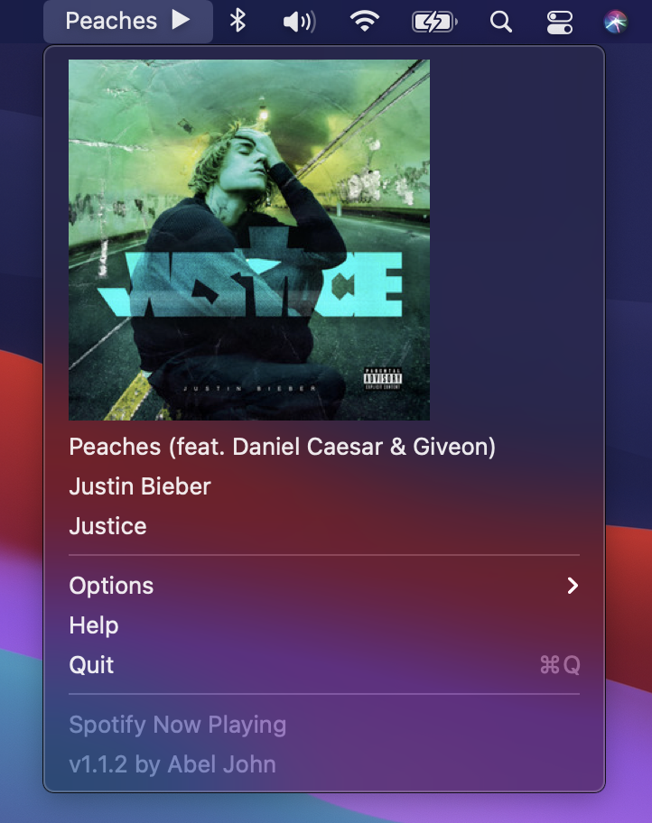
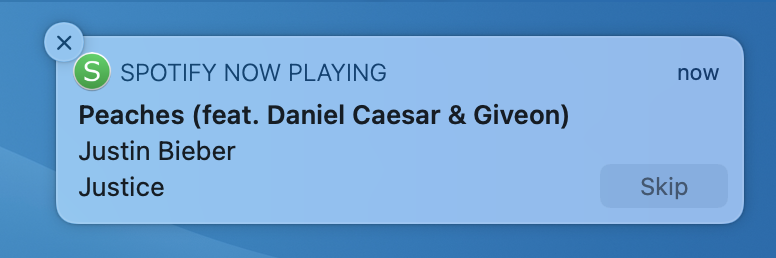
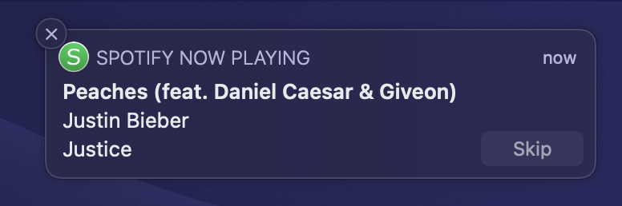

# Spotify Now Playing

macOS menubar application that enables Spotify playback control and song notifications

No Spotify login needed! Spotify Now Playing accesses the Spotify desktop app directly. (A public Spotify API is used to retrieve album artwork, but Spotify Now Playing is capable of running fully offline)

Written in Obj-C, designed for macOS 10.14+

## Installation

Download and unzip the [latest release](https://github.com/abeljohn/spotify-now-playing/releases/latest) ([direct download](https://github.com/abeljohn/spotify-now-playing/releases/latest/download/SpotifyNowPlaying.app.zip)), or download and compile the source in Xcode.

*Note: to bypass the warning for unidentified developer right click on the app in Finder, and select Open. Alternatively, go to System Preferences > Security & Privacy > General > Open Anyway. Or better yet, read through the source code and build it yourself!*

## Features

Song name in menubar
- optional playing indicator to show song is playing
- shortens song name by hiding parentheticals
- hover over song name to see full song name, artist, and album
- control music playback with a click and hold on song name to play/pause, click and drag right to skip, click and drag left to go back
- opening menubar application shows album art, full song name, artist, and album
- alternatively, the song name can be hidden to reduce menubar clutter

Song notifications
- optional notifications when a new song comes on
- ability to skip songs from notification, or click notification to bring up spotify

