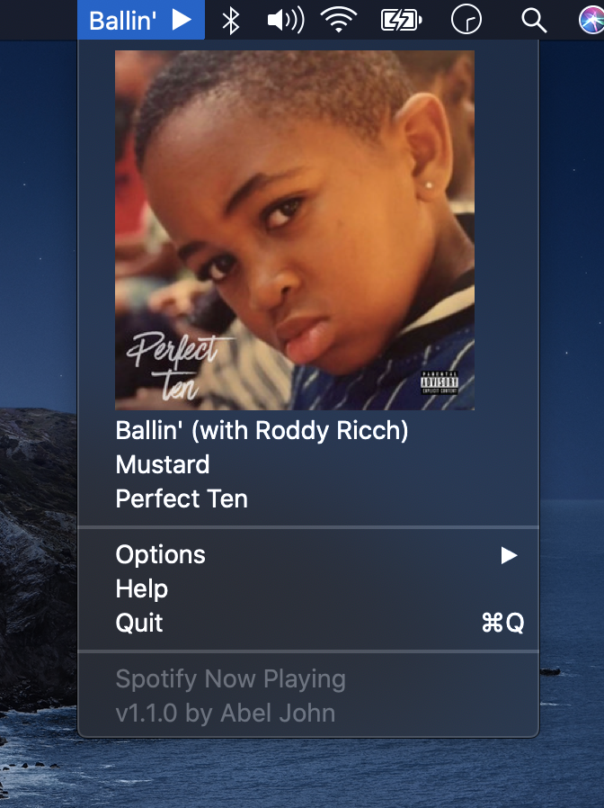
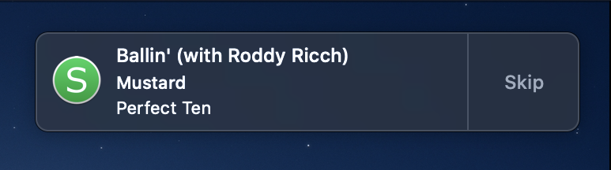

# Spotify Now Playing

macOS menubar application that enables Spotify playback control and song notifications

written in Obj-C, designed for macOS 10.14+

## Installation

Download and unzip the [latest release](https://github.com/abeljohn/spotify-now-playing/releases/latest) ([direct download](https://github.com/abeljohn/spotify-now-playing/releases/latest/download/SpotifyNowPlaying.app.zip)), or download and compile the source in Xcode.

*Note: to bypass the warning for unidentified developer go to System Preferences > Security & Privacy > General > Open Anyway.*

## Features

Song name in menubar
- optional playing indicator to show song is playing
- shortens song name by hiding parentheticals
- hover over song name to see full song name, artist, and album
- control music playback with a click and hold on song name to play/pause, click and drag right to skip, click and drag left to go back
- opening menubar application shows album art, full song name, artist, and album
- alternatively, the song name can be hidden to reduce menubar clutter

Song notifications
- optional notifications when a new song comes on
- ability to skip songs from notification, or click notification to bring up spotify

